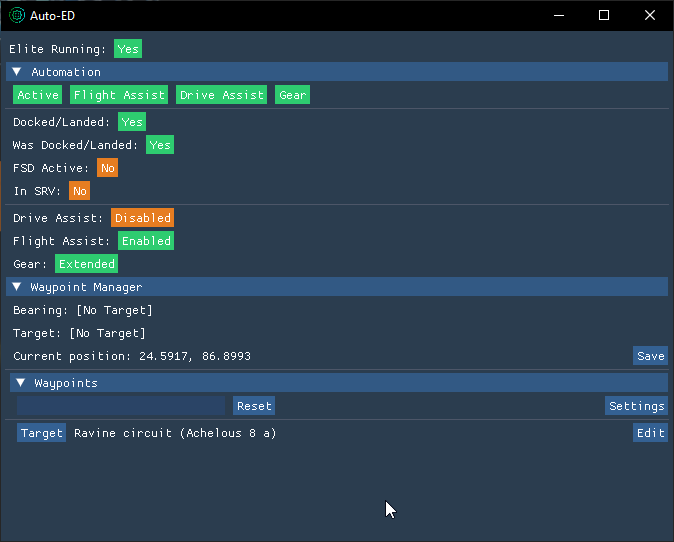

# Auto-ED
Auto Hotkeys for Elite: Dangerous

By Kami-Kaze

**Note:** This only works for Windows as of now.

# Installing
- Requires [Python](https://www.python.org/downloads/) 3.10 or later  (might work on 3.9 - no guarantees)
- Download the `Source code.zip` from the latest [release](https://github.com/Kaze-Kami/auto-ed/releases/latest)
- Unpack it and put it where ever you feel like it (though remember where!)
- Open the folder in a terminal and run `pip-install -r deps.txt` from a terminal (twice if the first one fails)

# Setup
Either run `python setup.py` from a terminal and follow the instructions to set the key binds

Or set the following key binds yourself (I recommend using the secondary bind, at least for gear so you can still use it)
> - Flight Assist: F9
> - Drive Assist: F10
> - Landing Gear: F11
> NB: All of these should be set to toggle, not hold

# Usage
- Navigate to where the `main.pyw` is located
- Run `pythonw main.pyw` from a terminal (Using `python` instead will give you a console)
- Give it a second, and you should see the following window:

The top row of (green) buttons are toggles, to enable different features and the app itself,
just click them to disable/enable a feature.

Below is some information on what the program is reading from ED.

The app minimizes to tray (Close, closes it!)

Clicking the tray icon shows the app, right-clicking it gives the option to close the app
